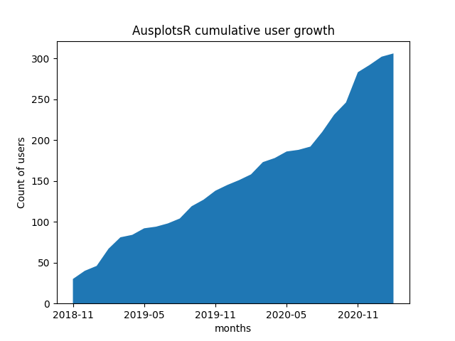

This is a Flask server that can serve up a chart of cumulative user growth of
AusplotsR users over time. The result looks like:

# Why
We can use Kibana to make a lot of charts but I can't figure out how to do this
one. We can make a cumulative chart with date based buckets on the x axis but
the unique constraint (applied to the IP address) is only done per bucket. This
means if we make the buckets one month each, and a user makes a request in two
months, they'll be counted two times. We need to apply the unique constraint,
then split the data into buckets. There might be a way but I couldn't figure it
out. This works for now.



# How to use it
At the time of writing, the ES server has no auth so it can't be exposed to the
public internet. That means you need to create an SSH tunnel and then connect
this tool to the tunnel port on your localhost. Alternatively, you could run it
on the machine that is running ES.

  1. create a virtual environment
      ```bash
      virtualenv -p python3 .venv
      . .venv/bin/activate
      ```
  1. install dependencies
      ```bash
      pip install -r requirements.txt
      ```
  1. start the server (read `main.py` code for default values)
      ```bash
      python main.py
      # OR, if you want to specify the ElasticSearch server because you're
      # running this on a remote server and connecting via SSH tunnel
      ES_URL_PREFIX=http://localhost:30002 python main.py
      ```
  1. grab the address from the output from the previous command:
      ```
      ...
      * Running on http://0.0.0.0:30006/ (Press CTRL+C to quit)
      ...
      ```
  1. open that address ([`http://0.0.0.0:30006/`]()) in your browser
